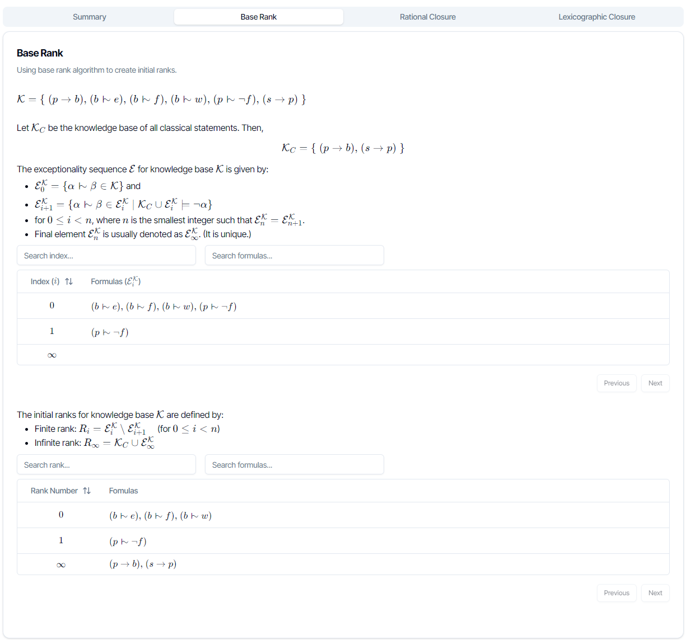

# extrc [](https://github.com/thabomoloi/extrc/actions/workflows/main.yml)

A defeasible reasoning tool implementing Rational Closure and Lexicographic Closure.

## Screenshots 





## Requirements

* Maven 3.9.8+
* Java 21+

## Compilation & Usage
There's a binary under `app/` folder which can be run without need for compilation. However, it still requires Java 21+. To run the binary run java -jar `docs/extrc-1.0-SNAPSHOT.jar` and go to `http://localhost:8080/`.
### Compilation
```bash
mvn clean package
```
### Usage 
```bash
java -jar target/extrc-1.0-SNAPSHOT.jar
```
After running the above command, visit `http://localhost:8080/` on your web browser. Chek the **Syntax** before sending the queries.

